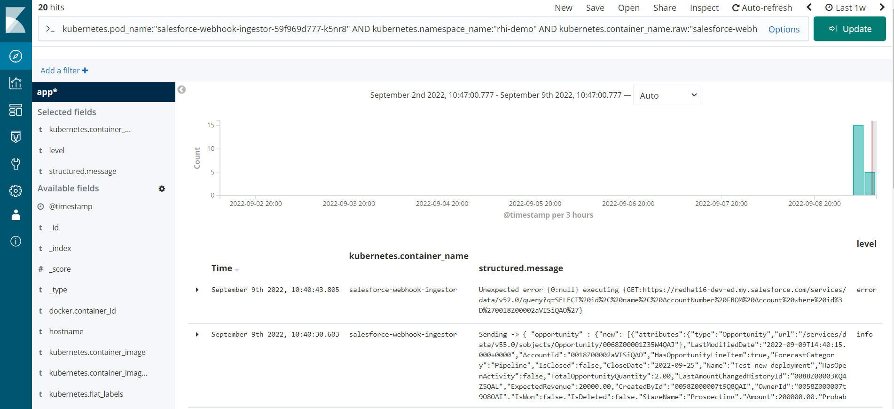
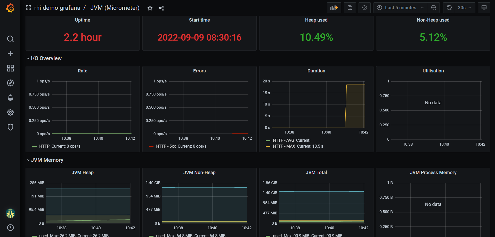
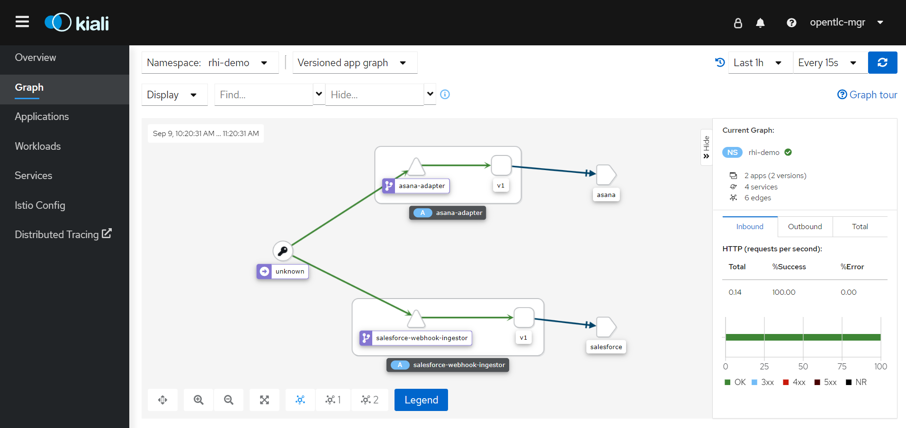

= Red Hat Integration Demo

Automation to deploy the Red Hat Integration Demo.

== Tools Available

=== OpenShift Logging

Visualize the integration logs using Kibana. The log content is mapped using LogForwarding rules.

=== OpenShift User Workload Monitoring

Check the application state using customized Grafana dashboards.

=== OpenShift Service Mesh

Visualize the integration topology using Kiali.

=== Integration with Quay.io

The images created in the demo are stored in Quay.io.

=== OpenShift Pipelines

Create images and upload them to an external service registry using Tekton Pipelines.

=== OpenShift GitOps

Deploy application and configuration while enforcing configuration using ArgoCD.

image::./img/argo.png[Argo]

=== 3scale

Expose a REST API on the internet using 3scale.

== Install The Demo Using Ansible

=== Parameters

[options="header"]
|=======================
| Parameter | Example Value                                      | Definition
| token     | sha256~vFanQbthlPKfsaldJT3bdLXIyEkd7ypO_XPygY1DNtQ | access token for a user with cluster-admin privileges
| server    | https://api.mycluster.opentlc.com:6443             | OpenShift cluster API URL
|=======================

=== Create an extra-vars file

Before running the Ansible playbook you must create a file to set some required credentials by the applications. You can use the following text as an template.

----
# Asana access and configuration information
asana_pat:
asana_workspace_gid:
asana_project_gid:
asana_field_opportunity:
asana_field_customer:
asana_field_booking:

# Salesforce access information
sf_client_id:
sf_client_secret:
sf_username:
sf_password:
sf_instance:

# In order to push the image to a private registry a .dockerconfigjson needs to be provided. You can skip this configuration if you don't intend to show Pipelines.
docker_config:

# This is the image registry URL used in the demo. You can skip this configuration if you don't intend to show Pipelines.
registry_url:

# These are the URL for the applications repositories. This is needed to build the image and deploy the application
ingestor_git:
asana_adapter_git:
----

=== Extra-vars definitions

* For information about Asana access properties look at asana-adapter's git repository.
* For information about Salesforce access properties look at salesforce-webhook-ingestor's git repository.

=== Deploying the demo

Export `token` and `server` as environment variable, then run under the `ansible` folder:

    ansible-playbook -e token=${token} -e server=${server}  --extra-vars @extra-vars.yml playbook.yml

=== Deleting the demo

    ansible-playbook -e token=${token} -e server=${server}  -e delete_demo=true playbook.yml

== Additional configurations

Once the demo is deployed you may need to do additional configurations that are not covered by the automation.

=== Kibana first search

When opening Kibana for the fist time you need to map the correct index for the searches. Use something like `app*` to do it.
